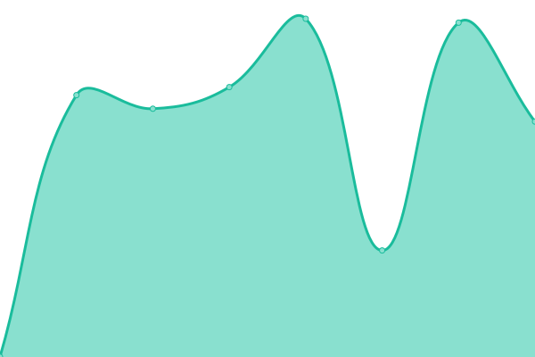

# [📈 Live Status](https://status.milar.farm): <!--live status--> **Todos los sistemas se encuentan operativos**

This repository contains the open-source uptime monitor and status page for [Milar](https://status.milar.farm), powered by [Upptime](https://github.com/upptime/upptime).

With [Upptime](https://upptime.js.org), you can get your own unlimited and free uptime monitor and status page, powered entirely by a GitHub repository. We use [Issues](https://github.com/TecnicaMilar/status/issues) as incident reports, [Actions](https://github.com/TecnicaMilar/status/actions) as uptime monitors, and [Pages](https://status.milar.farm) for the status page.

<!--start: status pages-->
<!-- This summary is generated by Upptime (https://github.com/upptime/upptime) -->
<!-- Do not edit this manually, your changes will be overwritten -->
<!-- prettier-ignore -->
| URL | Status | History | Response Time | Uptime |
| --- | ------ | ------- | ------------- | ------ |
|  [Pagina Web](https://milar.farm) | Activo | [pagina-web.yml](https://github.com/TecnicaMilar/status/commits/HEAD/history/pagina-web.yml) | 

 1284ms
     
 | 

<a href="https://status.milar.farm/history/pagina-web">100.00%</a>
    

|  [Sniper](https://sniper.milar.farm/login) | Activo | [sniper.yml](https://github.com/TecnicaMilar/status/commits/HEAD/history/sniper.yml) | 

 404ms
     
 | 

<a href="https://status.milar.farm/history/sniper">100.00%</a>
    

<!--end: status pages-->

[**Visit our status website →**](https://status.milar.farm)

## 📄 License

- Code: [MIT](./LICENSE) © [Anand Chowdhary](https://anandchowdhary.com), supported by [Pabio](https://pabio.com)
- Data in the `./history` directory: [Open Database License](https://opendatacommons.org/licenses/odbl/1-0/)
